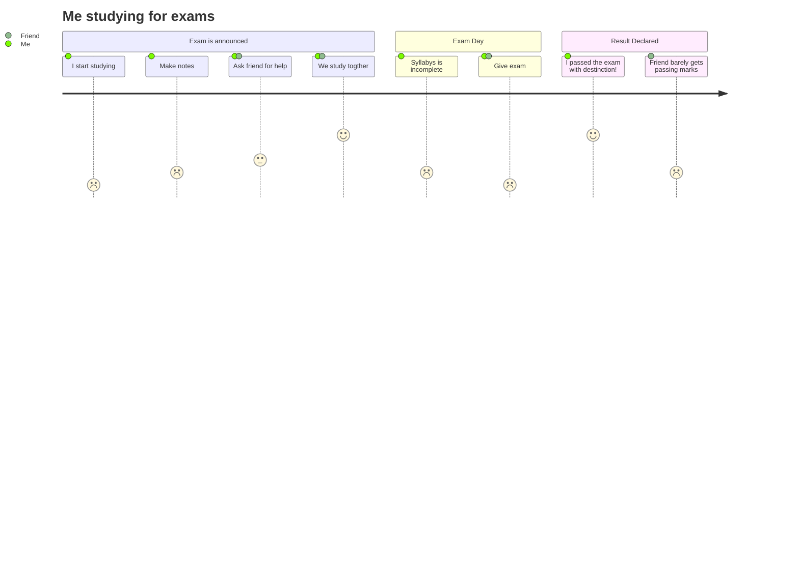

# work carried out 

in DQN network as for the sequential layers 

> inputs -> 16
    activation relu
    linear 16 -> 16
    activation relu
    output 16 -> num actions

# observation 
the q value mean was a constant and in a stable position 

# conclusion 
as for the control state i've removed the exploration by removing the epsilon 

because of this in order to be stabilize the model it chooses to do nothing at all and this is a good example where exploration was removed and network is not enough to determine a stable position. 

this experiment was a failed 

next is to introduce the epsilon and see how it performs 

